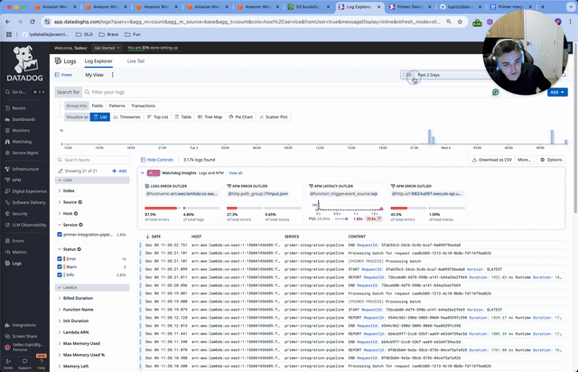
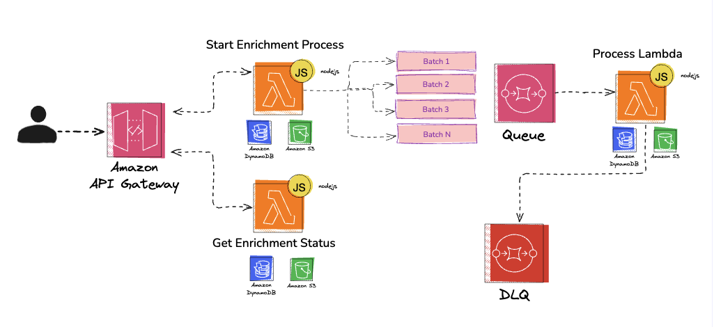
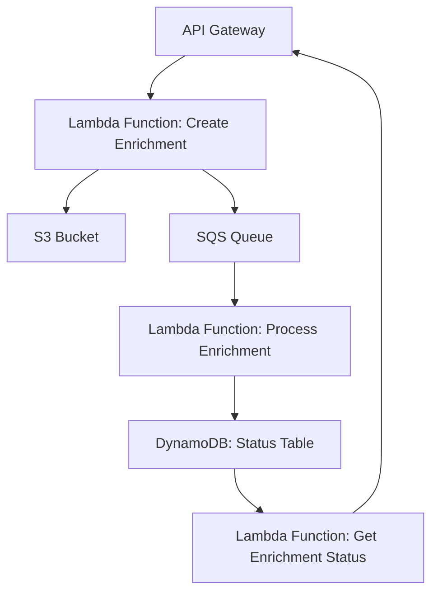
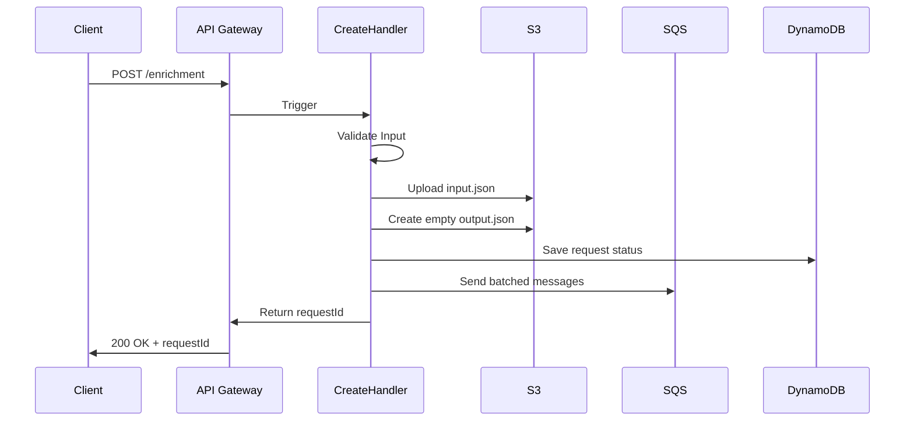
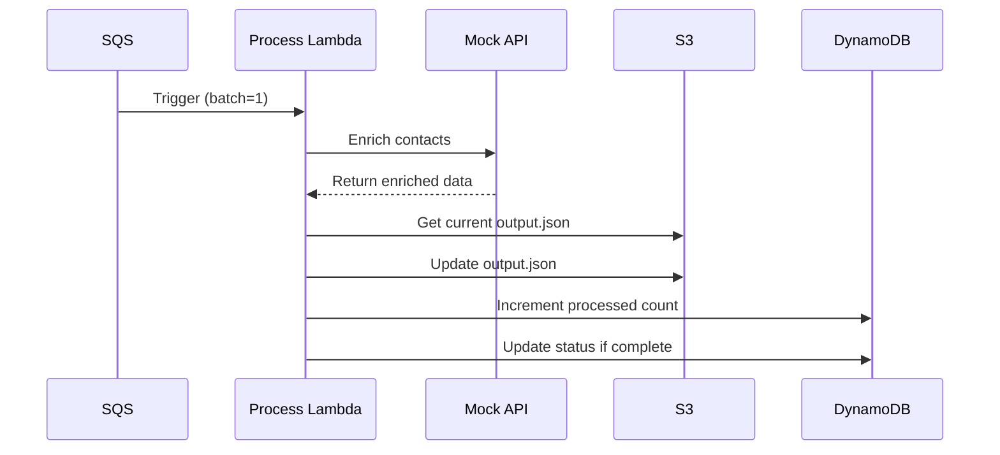
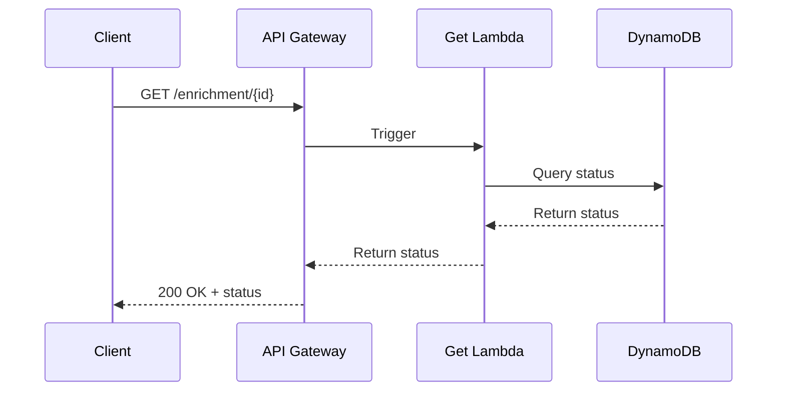

# Project Documentation

## Overview

This project is a serverless application built with the Serverless Framework, TypeScript, and AWS services. It provides an enrichment service that processes contact information and enriches it with additional data.

## Deploying & Running

```bash
npx sls deploy --aws-profile personal
npx ts-node src/scripts/createJson.ts 50 # create 50k contacts
npx ts-node src/scripts/createEnrichement.ts contacts_50k.json # create enrichment request
npx ts-node src/scripts/createEnrichement.ts contacts_100k.json true # create enrichment request and push to S3, for large datasets
```

#### Example

command:

```bash
npx ts-node src/scripts/createEnrichement.ts contacts_100k.json true
```

output:

```json
{
  "message": "Request accepted",
  "requestId": "4b92560e-5c60-4d90-9bdd-195f39f8a91d",
  "downloadUrl": "https://storage-primer.s3.amazonaws.com/4b92560e-5c60-4d90-9bdd-195f39f8a91d/output.json"
}
```

command:

```bash
./bin/getEnrichment.sh 4b92560e-5c60-4d90-9bdd-195f39f8a91d
```

output:

```json
{
  "requestId": "4b92560e-5c60-4d90-9bdd-195f39f8a91d",
  "status": "processing",
  "createdAt": "2024-12-11T16:36:13.453Z",
  "totalBatches": 1001,
  "processedBatches": 162,
  "outputFileKey": "https://storage-primer.s3.amazonaws.com/4b92560e-5c60-4d90-9bdd-195f39f8a91d/output.json"
}
```

## Showcase

Click on the image below to watch the showcase video or here [Link](https://cln.sh/bhWByGSF)

<p align="center">
  <a href="https://cln.sh/bhWByGSF">
    
  </a>
</p>

## Datadog

- Dashboard: [Link](https://p.datadoghq.com/sb/836b9d5c-b1bf-11ef-a55b-0ee733f937a2-ff8b75cf46559dca2d25a0e8de156a49?refresh_mode=sliding&from_ts=1733306292479&to_ts=1733320692479&live=true)
- Logs: [Link](https://app.datadoghq.com/logs?saved-view-id=3174992)
- APM: [Link](https://app.datadoghq.com/apm/entity/service%3Aprimer-integration-pipeline?dependencyMap=qson%3A%28data%3A%28telemetrySelection%3Aall_sources%29%2Cversion%3A%210%29&deployments=qson%3A%28data%3A%28hits%3A%28selected%3Aversion_count%29%2Cerrors%3A%28selected%3Aversion_count%29%2Clatency%3A%28selected%3Ap95%29%2CtopN%3A%215%29%2Cversion%3A%210%29&env=dev&errors=qson%3A%28data%3A%28issueSort%3AFIRST_SEEN%29%2Cversion%3A%210%29&fromUser=false&groupMapByOperation=null&infrastructure=qson%3A%28data%3A%28viewType%3Apods%29%2Cversion%3A%210%29&isInferred=false&logs=qson%3A%28data%3A%28indexes%3A%5B%5D%29%2Cversion%3A%210%29&operationName=aws.lambda&panels=qson%3A%28data%3A%28%29%2Cversion%3A%210%29&resources=qson%3A%28data%3A%28visible%3A%21t%2Chits%3A%28selected%3Atotal%29%2Cerrors%3A%28selected%3Atotal%29%2Clatency%3A%28selected%3Ap95%29%2CtopN%3A%215%29%2Cversion%3A%211%29&summary=qson%3A%28data%3A%28visible%3A%21t%2Cchanges%3A%28%29%2Cerrors%3A%28selected%3Acount%29%2Chits%3A%28selected%3Acount%29%2Clatency%3A%28selected%3Alatency%2Cslot%3A%28agg%3A95%29%2Cdistribution%3A%28isLogScale%3A%21f%29%2CshowTraceOutliers%3A%21t%29%2Csublayer%3A%28slot%3A%28layers%3Aservice%29%2Cselected%3Apercentage%29%2ClagMetrics%3A%28selectedMetric%3A%21s%2CselectedGroupBy%3A%21s%29%29%2Cversion%3A%211%29&traces=qson%3A%28data%3A%28%29%2Cversion%3A%210%29&start=1733314516685&end=1733318116685&paused=false#resources)

## Architecture

### E2E Architecture

- [Link](https://link.excalidraw.com/readonly/L0PvBWorR4GE36O1TEoF)

<p align="center">
  <a href="https://link.excalidraw.com/readonly/L0PvBWorR4GE36O1TEoF">
    
  </a>
</p>

### Lambda Architecture

The application is designed using a microservices architecture, leveraging AWS Lambda, S3, SQS, and DynamoDB. Below is a high-level architecture diagram:



### 1. Create Enrichment



### 2. Process Enrichment



### 3. Get Enrichment Status



## Key Components

### Handlers

- **Create Handler**: Handles incoming requests to create enrichment tasks. It validates input, stores data in S3, and sends messages to SQS for processing. Fan-out pattern.

- **Process Handler**: Processes messages from SQS, enriches contact data using a mock API, and updates the status in DynamoDB. Worker pattern.

- **Get Handler**: Retrieves the status of enrichment requests from DynamoDB.

### Infrastructure

- **S3 Adapter**: Manages interactions with AWS S3 for storing and retrieving objects.

- **SQS Adapter**: Handles sending messages to AWS SQS.

- **Status Repository**: Interacts with DynamoDB to manage the status of enrichment requests.

## Scripts

- **createEnrichment.sh**: Shell script to send a POST request to the enrichment API.
- **getEnrichment.sh**: Shell script to retrieve the status of an enrichment request.

## Configuration

- **tsconfig.json**: TypeScript configuration file.
- **.nvmrc**: Node version manager configuration file.

## Improvements

1. **S3 Direct Upload**

   - Instead of receiving huge JSON payloads, we could accept files directly in S3
   - Benefits: Improved latency and reduced costs

2. **High Volume Processing**

   - For large datasets (>100k contacts), implement more efficient processing
   - Solution: Use SQS for initial request and fan-out pattern for processing
   - Architecture: Post request to SQS → Process in separate lambda → Fan-out results to processing lambda

3. **Request Deduplication**
   - Implement SHA-256 signatures for request deduplication
   - Purpose: Prevent processing duplicate requests
   - Implementation:
     ```typescript
     export const getJsonHash = (obj: object): string => {
       const canonicalJSON = JSON.stringify(obj, Object.keys(obj).sort());
       return crypto
         .createHash("sha256")
         .update(canonicalJSON, "utf8")
         .digest("hex");
     };
     ```
   - Process:
     - Create signature from input using SHA-256
     - Store signature in request metadata
     - Verify signature before processing
     - Return cached result if duplicate detected
   - Why SHA-256? Secure hash function with strong collision resistance, widely used for digital signatures
