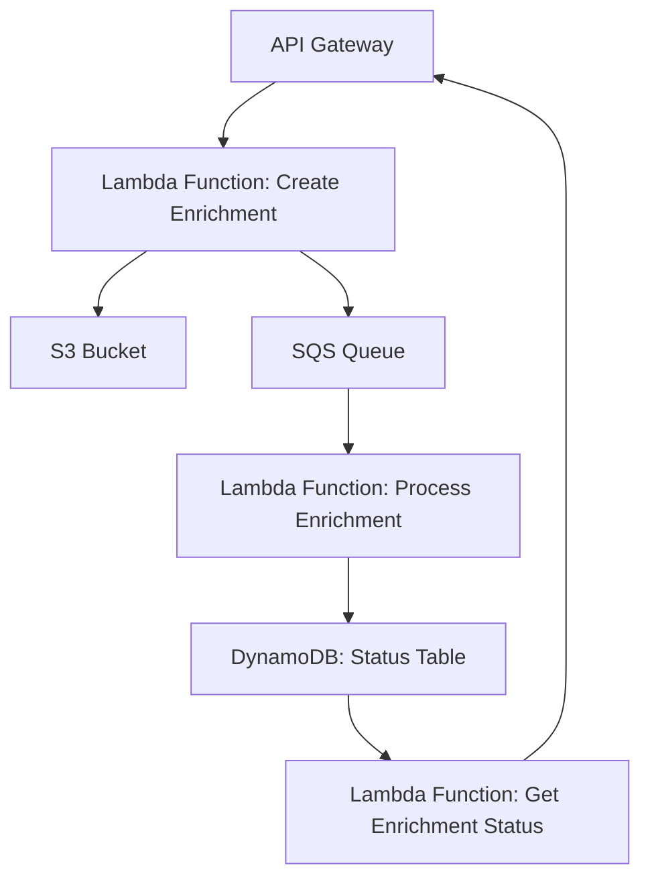
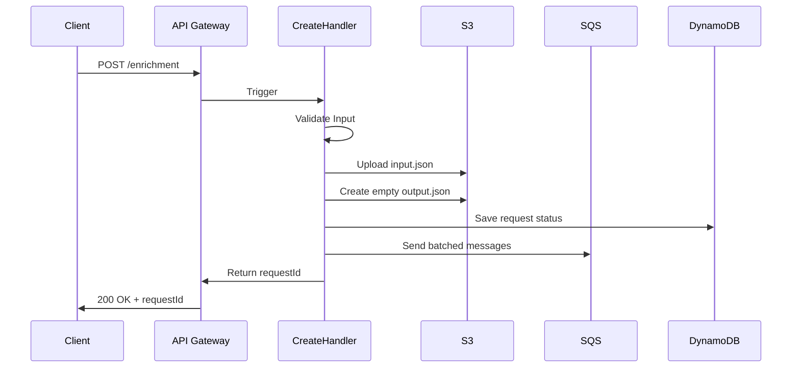
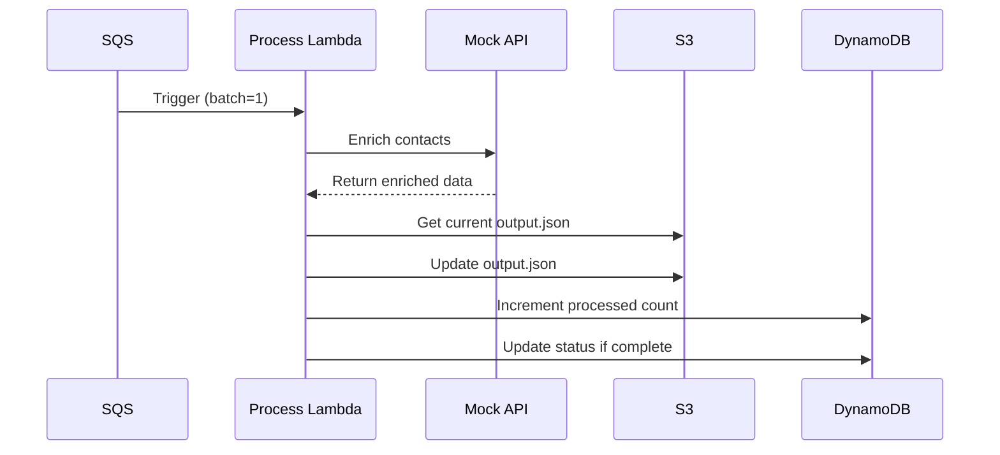
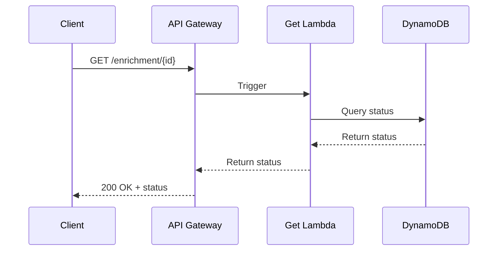

# Project Documentation

## Overview

This project is a serverless application built with the Serverless Framework, TypeScript, and AWS services. It provides an enrichment service that processes contact information and enriches it with additional data.

## Architecture

The application is designed using a microservices architecture, leveraging AWS Lambda, S3, SQS, and DynamoDB. Below is a high-level architecture diagram:



### 1. Create Enrichment



### 2. Process Enrichment



### 3. Get Enrichment Status



## Key Components

### Handlers

- **Create Handler**: Handles incoming requests to create enrichment tasks. It validates input, stores data in S3, and sends messages to SQS for processing. Fan-out pattern.

- **Process Handler**: Processes messages from SQS, enriches contact data using a mock API, and updates the status in DynamoDB. Worker pattern.

- **Get Handler**: Retrieves the status of enrichment requests from DynamoDB.

### Infrastructure

- **S3 Adapter**: Manages interactions with AWS S3 for storing and retrieving objects.

- **SQS Adapter**: Handles sending messages to AWS SQS.

- **Status Repository**: Interacts with DynamoDB to manage the status of enrichment requests.

## Scripts

- **createEnrichment.sh**: Shell script to send a POST request to the enrichment API.
- **getEnrichment.sh**: Shell script to retrieve the status of an enrichment request.

## Configuration

- **tsconfig.json**: TypeScript configuration file.
- **.nvmrc**: Node version manager configuration file.

## Deployment

To deploy the application, use the following command:

```
npm run deploy
```
